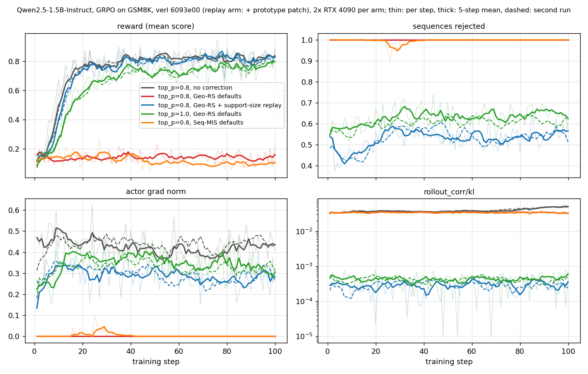

# Truncated sampling in verl: what it does to rollout correction, and a cheap fix

verl asks vLLM for `processed_logprobs`. With `top_p`, `top_k` or `min_p` truncating the
distribution, those are normalised over the tokens that survived, while the actor's
`old_log_probs` are normalised over the whole vocabulary. Every token's ratio then carries
the kept probability mass, with no policy change at all. This directory measures what that
does inside verl, how little data a fix needs, and what a prototype of that fix does over
100 training steps.

Sections 1-3 ran on verl `main` at 6093e00, vLLM 0.28.0, torch 2.13.0+cu126,
transformers 5.12.1, one NVIDIA L40, GRPO on GSM8K, 32 prompts x 4 samples per step,
temperature 1.0. Section 4 uses the same software and settings on two RTX 4090s per run.

## 1. The term is in verl's own metrics

Qwen2.5-0.5B-Instruct, token-level rollout IS, 3 steps (`0a_*` in [results/gates.json](results/gates.json)):

| | `rollout_corr/rollout_is_mean`, steps 1-3 | `rollout_corr/kl` |
|---|---|---|
| `top_p=1.0` | 0.99994, 0.99984, 0.99995 | 0.00075, 0.00081, 0.00067 |
| `top_p=0.8` | 0.96371, 0.96385, 0.96802 | 0.03921, 0.03900, 0.03449 |

## 2. Two presets then reject everything, and training stops behind a generic warning

Qwen2.5-1.5B-Instruct, which earns reward on this task; FSDP2 with CPU offload; 2 steps
(`0c_*`). verl's sampler shuffles with an unseeded `torch.Generator`, whose seed is a fixed
default, so every arm sees the same batches; on them the uncorrected arm's advantages run
from -1.5 to 1.5.

| arm | rejected sequences | `actor/grad_norm` | `critic/score/mean` |
|---|---|---|---|
| `top_p=0.8`, no correction | - | 0.34501, 0.45507 | 0.13281, 0.18750 |
| Geo-RS defaults, `top_p=1.0` | 0.55469, 0.57031 | 0.15140, 0.26527 | 0.05469, 0.19531 |
| Geo-RS defaults, `top_p=0.8` | **1.0, 1.0** | **0.0, 0.0** | 0.08594, 0.16406 |
| Seq-MIS defaults, `top_p=0.8` | **1.0, 1.0** | **0.0, 0.0** | 0.07812, 0.21875 |

"Defaults" are `decoupled_geo_rs()` (`seq_mean_k1`, `0.999_1.001`) and `decoupled_seq_is_rs()`
(sequence IS at 2.0, `seq_sum_k1` at `0.5_2.0`). When every token is rejected, the only sign
is a generic warning at each step, `Response mask is all False, returning default advantage
metrics`, with `critic/advantages/*` logged as NaN. Nothing in it names the rejection, the
preset or the truncation behind it; the number that gives it away is `actor/grad_norm` at
exactly 0. The
rejection at `top_p=1.0` comes from the engine/trainer mismatch that remains without
truncation in this setup (sdpa, `use_remove_padding=False`); it was not checked with
flash-attn.

The same pattern on Qwen2.5-0.5B-Instruct (`0b_*`) adds a third preset, K3-RS
(`seq_mean_k3`, 0.01), which rejects nothing at either `top_p`: for a near-uniform shift K3
is second order in the log-ratio, so it does not see the term that is still in the weights.

## 3. The fix needs one integer per token

top-k, top-p and min-p all keep a prefix of the tokens sorted by probability, so the kept set
is "the |S| most likely tokens". vLLM 0.28 returns the kept ids (`return_sampling_mask=True`);
replaying only their count lets the trainer take its own top-|S| and renormalise. On the same
sampled tokens ([support_size_replay.py](support_size_replay.py), Qwen2.5-1.5B-Instruct,
64 GSM8K prompts, trainer = HF bf16 at batch 1, [results](results/support_size_replay.json)):

| sampling | mean \|S\| | trainer top-\|S\| equals vLLM's set | ratio mean, no correction | exact ids | size only | out of [0.9, 1.1]: none / ids / size |
|---|---|---|---|---|---|---|
| `top_p=0.8` | 1.31 | 99.52% | 0.9640 | 0.9999 | 0.9999 | 16.37% / 0.90% / 0.91% |
| `top_p=0.95` | 2.35 | 98.37% | 0.9869 | 0.9999 | 0.9999 | 2.63% / 2.04% / 2.03% |
| `top_p=0.9`, T=0.7 | 1.27 | 99.65% | 0.9873 | 0.9994 | 0.9994 | 3.82% / 2.34% / 2.35% |
| `top_k=20` | 20.00 | 72.09% | 0.9978 | 1.0002 | 1.0002 | 2.69% / 2.50% / 2.50% |
| `min_p=0.05` | 1.65 | 99.87% | 0.9822 | 0.9999 | 0.9999 | 5.16% / 1.58% / 1.58% |

Where the two sets differ, they differ at the boundary, on tokens with almost no mass, so
the two corrections agree to the fourth decimal. The count is 1 integer per token; the ids
are |S| per token, and 1024 under a `top_k=1024` cap with `top_p=1.0`.

## 4. Over 100 steps the stall holds, and replaying the support size ends it

Qwen2.5-1.5B-Instruct, 100 steps per run, each run on two RTX 4090s (FSDP2 shards the
optimizer; no CPU offload) ([run_long.sh](run_long.sh); every step is in
[results/long_arms.json](results/long_arms.json), the table below in
[results/long_summary.json](results/long_summary.json)). The replay run is verl with
[prototype/support_size_replay.patch](prototype/) applied, plus `top_k=1024`, which vLLM
requires before it replays the kept set.



| run | reward, steps 1-10 | reward, last 20 steps | sequences rejected, mean | steps with zero gradient | `rollout_corr/kl`, mean |
|---|---|---|---|---|---|
| `top_p=0.8`, no correction | 0.34 | 0.83 | - | 0 | 0.039 |
| `top_p=0.8`, Geo-RS defaults | 0.13 | 0.14 | **1.0** | **100** | 0.034 |
| `top_p=0.8`, Seq-MIS defaults | 0.14 | 0.10 | **0.997** | **89** | 0.034 |
| `top_p=0.8`, Geo-RS + support-size replay | 0.28 | 0.82 | 0.53 | 0 | 0.00029 |
| `top_p=1.0`, Geo-RS defaults | 0.20 | 0.77 | 0.63 | 0 | 0.00043 |

Geo-RS at `top_p=0.8` rejects every sequence at every one of the 100 steps, and verl prints
its generic warning 100 times; the reward does not move, while the uncorrected run's climbs
from 0.34 to 0.83. Seq-MIS lets a few sequences through in some steps, but every sequence is
rejected in 86 of the 100 steps and 89 have zero gradient: its reward ends lower than it
started.

With the support size replayed, `rollout_corr/kl` falls from 0.034 to 0.00029, below the
0.00043 of `top_p=1.0`, where nothing is truncated. Geo-RS then rejects 0.53 of the sequences,
fewer than the 0.63 it rejects at `top_p=1.0`; the rest is the engine/trainer mismatch that
section 2 finds even without truncation, and a `0.999_1.001` band is narrow enough to see it.
The reward follows the uncorrected run (0.82 against 0.83 over the last 20 steps). About half
the sequences are still rejected, and the replay run's mean gradient norm is 0.29, against
0.42 without correction.

A second run of the three arms whose outcome varies from run to run (vLLM sampling is
unseeded; every run sees the same prompts at each step) lands in the same place, dashed in the
figure. Over the last 20 steps the reward is 0.80 without correction, 0.80 with the replay and
0.76 at `top_p=1.0`. The replay run rejects 0.53 of the sequences against 0.61 at `top_p=1.0`,
with kl 0.00029 against 0.00042.

The `top_k=1024` cap is not what helps. On Qwen2.5-0.5B-Instruct over 2 steps, Geo-RS at
`top_p=0.8` with the cap but without the replay still rejects every sequence (kl 0.039 and
0.040); with the replay it rejects 0.45 and 0.52 (kl 0.00051 and 0.00028)
([results/replay_check_0p5b.json](results/replay_check_0p5b.json), `run_gates.sh replay_check`).

## Reproducing

```bash
python verl/examples/data_preprocess/gsm8k.py --local_save_dir ~/data/gsm8k   # from a verl checkout
bash run_gates.sh 0a     # then 0b, 0c; each run writes logs/<tag>.log
python collect.py results/gates.json logs/*.log
python support_size_replay.py Qwen/Qwen2.5-1.5B-Instruct results/support_size_replay.json
VERL_PATCHED=/path/to/patched/verl bash run_gates.sh replay_check
bash run_long.sh 0,1 nocorr_tp08   # likewise geo_tp08, seqmis_tp08, geo_tp10, and geofix_tp08 with VERL_PATCHED;
                                   # RUN=r2 for the second runs
python collect.py results/long_arms.json logs/long_*.log
python summarize_long.py results/long_arms.json results/long_summary.json
python plot_long.py results/long_arms.json results/long_arms.png
```

Unless `GPU=` pins the cards, `gate.sh` refuses to start on a GPU with less than 30 GB free.
The raw logs are not committed: they are mostly Ray's and vLLM's own output, full of
machine-specific paths; `collect.py`
turns any set of them into the JSON above, and it reproduces the committed file from the
original logs value for value.

## What this does not show

Two runs for the no-correction, replay and `top_p=1.0` arms and one for the rest, two small
models (0.5B and 1.5B), one node. Sections 1-3 are 2-3 steps per
run; the 100-step runs of section 4 are on other cards (RTX 4090) and without CPU offload. The
trainer in section 3 is HF transformers, not verl's actor, so it bounds the replay error rather
than measuring it in verl. Section 4 does run the replay inside verl's actor, but only on the
path the prototype covers: vLLM rollout, the single-turn agent loop, the v1 trainer, the FSDP
engine without fused kernels, and decoupled mode.
